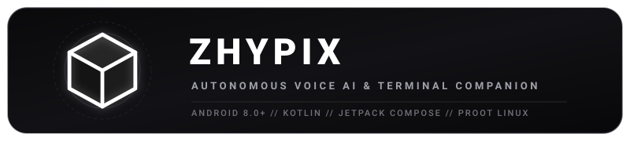

<p align="center">
  
</p>

<p align="center">
  
</p>

# Zhypix: Autonomous Voice AI & Terminal Companion for Android

<p align="center">
  <a href="https://developer.android.com"></a>
  <a href="https://kotlinlang.org"></a>
  <a href="https://developer.android.com/compose"></a>
  <a href="LICENSE.md"></a>
</p>

Talk naturally with a lifelike voice assistant, run local Linux commands inside a built-in terminal sandbox, and let AI automate your Android device hands-free. Zhypix brings the power of state-of-the-art language models and shell tooling directly to your fingertips.

---

## Table of Contents

*   [Demo & Screenshots](#demo--screenshots)
*   [Overview](#overview)
*   [Key Features](#key-features)
*   [System Requirements & Permissions](#system-requirements--permissions)
*   [Privacy & Security](#privacy--security)
*   [Installation](#installation)
*   [Quick Start & Setup](#quick-start--setup)
*   [Technical Architecture](#technical-architecture)
*   [License & Author](#license--author)

---

## Demo & Screenshots

| **Sandboxed Linux Terminal** | **System Automation** |
| :---: | :---: |
| <video src="297.mp4" controls="controls" width="100%"></video><br>[Watch Demo (297.mp4)](297.mp4) | <video src="279.mp4" controls="controls" width="100%"></video><br>[Watch Demo (279.mp4)](279.mp4) |
| Fully functional interactive shell (`guest@zhypix`) | Accessibility service gesture triggers & swiping |

---

## Overview

Zhypix is an all-in-one autonomous companion designed to make your Android device smarter, faster, and more interactive. By bridging advanced Large Language Models (LLMs) with Android’s system capabilities, Zhypix acts as a helpful sidekick that can:

- **Chat with you naturally** using crisp, high-definition voices across multiple languages.
- **Automate tasks on your phone** like clicking buttons, swiping through feeds, and adjusting system settings hands-free.
- **Execute local Linux commands** in a sandboxed, fully interactive terminal emulator.
- **Float over other apps** so your assistant is always ready to assist with a single tap.

---

## Key Features

### 1. On-Screen Automation & Gestures
* **Hands-Free Gestures**: Integrates with `ZhypixAccessibilityService` to perform automated gestures, swipes, and click inputs on your screen.
* **Direct Intent Routing**: Executes instant Android operations—such as setting alarms, dialing numbers, opening Google Maps, and navigating system settings—bypassing visual UI latency.

### 2. Sandboxed Linux Terminal (`guest@zhypix`)
* **Built-in Linux Console**: Run an interactive Linux shell sandbox directly inside your chat workspace.
* **Command Pipelines**: Execute shell scripts, inspect system files, and monitor real-time outputs in a sleek monospace terminal UI.

### 3. Always-On Floating Overlay
* **Multi-tasking Floating Widget**: Launch a miniature floating bubble that stays on top of other apps, giving you instant access to voice input and automation anywhere on your device.

---

## System Requirements & Permissions

### Device Compatibility
* **Android OS**: Android 8.0 (API level 26) or higher.
* **Architecture**: `arm64-v8a` recommended for optimal terminal performance.

### Required Permissions
| Permission | Purpose |
| :--- | :--- |
| **Accessibility Service** | Enables Zhypix to perform click and swipe gestures on your behalf. No personal data is stored. |
| **Display Over Other Apps** | Renders the persistent floating overlay bubble over active apps. |
| **Microphone Access** | Processes voice input for Speech-to-Text conversion. |

---

## Privacy & Security

* **Direct Provider Connections**: Zhypix connects directly to your configured AI provider endpoint (e.g. Google Gemini API). No intermediary proprietary servers relay your data.
* **Local Sandboxing**: The terminal environment operates completely within your device's local memory sandbox.
* **Secure Credentials**: API keys entered in settings are stored securely within local private storage / Android Keystore.

---

## Installation

### Pre-built Package
Download the latest APK binary from the [Releases](https://github.com/ashveil1/zhypix/releases) section.

### Build From Source
To compile and assemble the APK manually:

```bash
# 1. Clone the repository
git clone https://github.com/ashveil1/zhypix.git
cd zhypix

# 2. Build the Debug APK package
./gradlew assembleDebug

# 3. Find the compiled APK file at:
# app/build/outputs/apk/debug/app-debug.apk
```

---

## Quick Start & Setup

1. **Configure API Key**:
   * Open **Settings** inside the app.
   * Enter your **Google Gemini API Key** (or preferred provider credentials).
   * Select your target model from the model picker.
2. **Enable System Permissions**:
   * **Accessibility Service**: Go to Android **Settings** → **Accessibility** → **Zhypix Service** → Turn **ON**.
   * **Display Over Other Apps**: Grant overlay permission when prompted.
3. **Start Talking or Automating**:
   * Tap the microphone icon to begin speaking, or launch the floating overlay for on-the-go control!

---

## Technical Architecture

```
+-------------------------------------------------------------+
|                     Zhypix Main App / UI                    |
|             (Jetpack Compose, Flow-based States)            |
+------------------------------+------------------------------+
                               |
                               v
+-------------------------------------------------------------+
|                        AgentViewModel                       |
|           (Main State Engine, LLM Coordinator, TTS)          |
+-------+-------------------+--------------------+------------+
        |                   |                    |
        v                   v                    v
+---------------+   +---------------+    +--------------------+
| Edge / Google |   | Linux Terminal|    |  Accessibility     |
| TTS Engine    |   | Simulator     |    |  Service Helper    |
| (EdgeTtsMgr)  |   | (Distro/Bash) |    |  (Gestures/Clicks) |
+---------------+   +---------------+    +--------------------+
```

### Tech Stack Summary
* **Language**: Kotlin 2.0+ (Coroutines & StateFlow)
* **UI Framework**: Jetpack Compose (Material 3)
* **Local Storage**: Room Database
* **Networking**: Ktor / Retrofit for high-throughput streaming
* **Audio Engine**: Edge TTS Manager & Android SpeechRecognizer

---

## License & Author

Distributed under the **Apache License 2.0**. See [`LICENSE.md`](LICENSE.md) for details.

Developed by **[Ashveil1](https://github.com/ashveil1)**.


